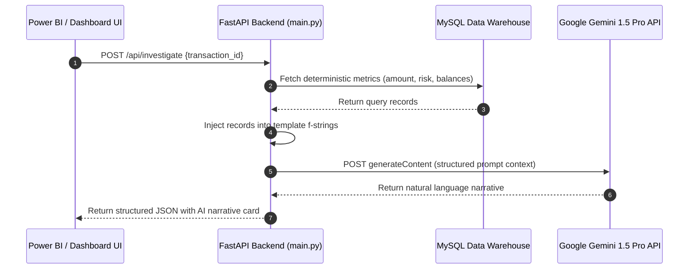
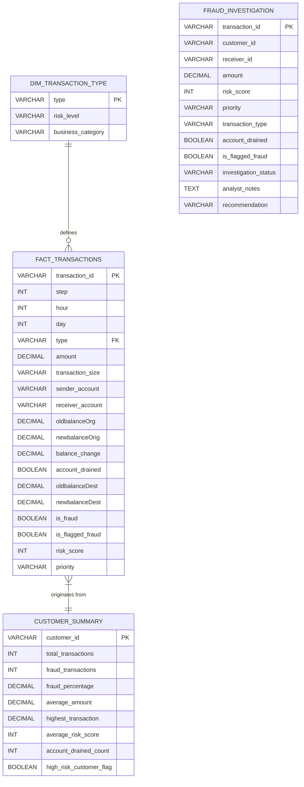

# 🛡️ FraudLens AI: Enterprise Fraud Analytics & Copilot

[](https://fastapi.tiangolo.com)
[](https://www.mysql.com)
[](https://deepmind.google/technologies/gemini)
[](https://www.python.org)

**FraudLens AI** is a production-ready, highly explainable AI copilot layer built for enterprise-grade fraud analysis of high-volume financial transactions. Designed from the ground up to reflect the strict governance standards of financial institutions (like American Express), the system avoids flaky "black-box" autonomous agents and instead uses a deterministic, highly secure **SQL-to-Prompt workflow** to ensure 100% data provenance, mathematical accuracy, and zero hallucinations.

---

## 📖 Table of Contents
1. [Architectural Philosophy](#-architectural_philosophy)
2. [Data Flow Sequence](#-data_flow_sequence)
3. [Repository Structure](#-repository_structure)
4. [Database & Analytics Warehouse Schema](#-database_and_analytics_warehouse_schema)
5. [API Endpoint Documentation](#-api_endpoint_documentation)
6. [Getting Started & Installation](#-getting_started_and_installation)
7. [Enterprise Analytics Pipeline (ETL)](#-enterprise_analytics_pipeline_etl)
8. [Dashboard Integration (Power BI & UI)](#-dashboard_integration_power_bi_and_ui)
9. [Interview Readiness & Design Defensibility](#-interview_readiness_and_design_defensibility)

---

## 🧠 Architectural Philosophy

> 💡 **The Golden Rule of Analytics AI:** Large Language Models (LLMs) cannot calculate KPIs or perform math reliably, nor should they generate and run raw SQL directly against schemas in production. Doing so introduces critical risks of hallucinations, prompt injection, and database crashes.

FraudLens AI splits these responsibilities deterministically:
*   **Deterministic Calculations:** MySQL and Pandas perform the heavy mathematical aggregation.
*   **Explainable Narratives:** Gemini 1.5 Pro translates the structured query results into human-readable executive insights and analyst reports.
*   **Zero-Agent Design:** No LangChain, LangGraph, or Vector Databases (RAG) are used. The application relies entirely on clean Python services, f-string prompts, and FastAPI endpoints.

---

## 🔄 Data Flow Sequence



---

## 📂 Repository Structure

Below is the directory structure layout for the FraudLens AI codebase:

```text
fraudlens-AI/
├── backend/                   # FastAPI Web Server & Routing
│   ├── main.py                # REST Endpoints (FastAPI)
│   ├── config/
│   │   └── settings.py        # Environment variables & API credentials loader
│   ├── database/
│   │   └── db.py              # SQLAlchemy DB connection & query executors
│   ├── services/
│   │   └── ai_service.py      # Core orchestration (SQL context injection & Gemini client)
│   ├── prompts/
│   │   └── templates.py       # Centralized strict Prompt Templates (f-strings)
│   └── utils/
│       └── error_handlers.py  # Outage fallbacks & API timeout controls
├── data/                      # Transaction Data Repositories
│   ├── raw/                   # Raw transaction CSV datasets (git-ignored)
│   └── processed/             # Engineered data outputs (git-ignored)
├── docs/                      # Architectural Specification Docs
│   ├── ai_architecture.md     # AI prompt and REST specifications
│   └── analytics_warehouse_architecture.md # SQL warehouse layout & deployment guides
├── sql/                       # Reference Analytical SQL Queries
│   ├── customer_queries.sql   # Customer metrics calculations
│   ├── dashboard_queries.sql  # Power BI dashboard views
│   ├── executive_queries.sql  # Macro status aggregation routines
│   ├── genai_queries.sql      # AI schema extraction metrics
│   ├── investigation_queries.sql # Single incident search queries
│   └── risk_queries.sql       # Risk profile metrics
└── src/                       # ETL & Engineering Scripts
    ├── business_validation.py # Data governance validation checks
    ├── eda.py                 # Exploratory data analysis scripts
    ├── feature_engineering.py # Data engineering pipeline
    ├── fraud_pattern_analysis.py # Pattern clustering script
    ├── features/
    │   └── build_features.py  # Feature engineering definitions
    └── db/
        ├── schema.sql         # Database schema (Tables, Indexes, Views)
        └── load_to_mysql.py   # Python-based ELT orchestrator
```

### 🔗 Key Source References
*   Backend Endpoint Routing: [backend/main.py](file:///d:/fraudlens-AI/backend/main.py)
*   AI Service Logic: [backend/services/ai_service.py](file:///d:/fraudlens-AI/backend/services/ai_service.py)
*   Database Engine Interface: [backend/database/db.py](file:///d:/fraudlens-AI/backend/database/db.py)
*   SQL Database Schema: [src/db/schema.sql](file:///d:/fraudlens-AI/src/db/schema.sql)
*   Python ETL Pipeline Script: [src/db/load_to_mysql.py](file:///d:/fraudlens-AI/src/db/load_to_mysql.py)
*   AI Prompt Engineering Templates: [backend/prompts/templates.py](file:///d:/fraudlens-AI/backend/prompts/templates.py)

---

## 🗄️ Database & Analytics Warehouse Schema

The data warehouse uses a hybrid schema model: a normalized transaction core connected to materialized metrics and summary tables.



*   **`FACT_TRANSACTIONS`**: Houses 6.3M+ records. Structured for low-latency lookups using primary keys and custom compound indices.
*   **`CUSTOMER_SUMMARY`**: Pre-calculated (materialized) customer behavioral metrics. Used by Python to extract historical context variables instantly.
*   **`FRAUD_INVESTIGATION`**: Operational workflow table allowing fraud analysts to update status tags (`Pending`, `Reviewing`, `Approved`, `Flagged`) and append case reviews.

---

## 🔌 API Endpoint Documentation

The FastAPI backend exposes exactly four REST endpoints for downstream applications:

### 1. Single Transaction Investigation
*   **Route:** `POST /api/investigate`
*   **Payload:** `{"transaction_id": "TXN12345"}`
*   **Action:** Fetches metrics from `FACT_TRANSACTIONS`, extracts sender history, builds context f-string, and returns Gemini explanation dossier.
*   **Sample Response:**
    ```json
    {
      "transaction_id": "TXN12345",
      "ai_investigation_card": "### Summary\nTransaction TXN12345 is flagged high-risk due to a sudden account drain...\n\n### Risk Analysis\n- Amount: $450,000\n- Historic fraud rate: 12%\n- Risk Score: 85/100"
    }
    ```

### 2. Executive Summary Report
*   **Route:** `POST /api/executive-summary`
*   **Payload:** `{"day": 1}`
*   **Action:** Queries aggregated analytics views, builds report metrics, and generates a macro narrative.

### 3. Customer Profile Investigation
*   **Route:** `POST /api/customer-summary`
*   **Payload:** `{"customer_id": "C98765"}`
*   **Action:** Returns a summary of customer risk profiles based on historical transactional indicators.

### 4. Interactive Dashboard Insights
*   **Route:** `POST /api/dashboard-insights`
*   **Payload:** `{"kpi_payload": {"current_day": 12, "active_fraud_alerts": 42}}`
*   **Action:** Synthesizes custom-filtered Power BI widgets into real-time bullet-point recommendations.

---

## ⚙️ Getting Started & Installation

### Prerequisites
*   Python 3.10+
*   MySQL Server (v8.0+)
*   Gemini API Key (Google AI Studio)

### 1. Setup Virtual Environment
```bash
# Clone the repository
git clone https://github.com/Akshatjain233/FraudLens.git
cd fraudlens-AI

# Create virtual environment
python -m venv .venv
# Activate environment (Windows)
.venv\Scripts\activate
# Activate environment (macOS/Linux)
source .venv/bin/activate

# Install dependencies
pip install -r backend/requirements.txt
# (or install core dependencies manually)
pip install fastapi uvicorn sqlalchemy pymysql pandas requests pydantic cryptography
```

### 2. Configure Environment Variables
Create a file named `.env` in the root folder of the project:
```env
MYSQL_USER="root"
MYSQL_PASS="your_mysql_password"
MYSQL_HOST="127.0.0.1"
MYSQL_PORT="3306"
MYSQL_DB="fraudlens_db"
GEMINI_API_KEY="your_google_gemini_api_key_here"
```

---

## 🚀 Enterprise Analytics Pipeline (ETL)

To load the database and generate all materialized analytical views, run the bulk data loader script:

```bash
python src/db/load_to_mysql.py
```

**What this script does:**
1. Dynamically boots the `fraudlens_db` database in MySQL.
2. Executes [schema.sql](file:///d:/fraudlens-AI/src/db/schema.sql) to generate core tables, indices, and views.
3. Loads raw transactions from `data/processed/engineered_transactions.csv` using Pandas chunking (safely handling millions of rows in memory).
4. Populates the `CUSTOMER_SUMMARY`, `FRAUD_INVESTIGATION`, and hourly/daily summaries.

---

## 📊 Dashboard Integration (Power BI & UI)

Downstream business intelligence and UI systems consume FraudLens AI via two patterns:
1.  **DirectQuery Visuals:** Power BI hooks directly into MySQL analytical views (e.g. `vw_high_risk_transactions`) for sub-second, interactive reporting.
2.  **Power Automate Action Triggers:** When a fraud analyst clicks an investigation action button in Power BI, it triggers a Power Automate flow, calling the FastAPI REST endpoint. The generated natural language card is returned and displayed directly inside the workspace UI.

---

## 💼 Interview Readiness & Design Defensibility

### 💬 "Why this architectural design?" (The Elevator Pitch)
> *"I designed the AI layer to be completely deterministic and governed. Most AI systems in business intelligence fail because they give LLMs access to database connections (Text-to-SQL) or rely on agents to aggregate metrics, leading to critical hallucinations or broken queries during database schema changes. My architecture decouples math from narration: SQL handles the heavy arithmetic, while Gemini is used solely for natural language synthesis. This guarantees 100% mathematical accuracy, high reliability, and a significant drop in Case Resolution Time (TTR) for analysts."*

### ❓ Key Interview Defense Questions
*   **Why avoid RAG (Vector Search) for this project?**
    *   *RAG is designed for searching unstructured documents like PDFs or markdown manuals. For tabular transaction logs, vectorizing values like monetary amounts loses the numerical relationships. Structured SQL remains the optimal way to query financial logs.*
*   **What if the Gemini API goes down?**
    *   *The FastAPI service contains exception handling (see [error_handlers.py](file:///d:/fraudlens-AI/backend/utils/error_handlers.py)). If Gemini is unreachable or times out, the API falls back to raw structured SQL facts and logs an alert: `{"error": "AI Copilot currently unavailable. Please review the raw transaction data below."}`. The system fails gracefully without blocking the analyst.*
*   **Why FastAPI instead of Django?**
    *   *FastAPI is highly asynchronous, lightweight, and supports native Pydantic validation. Since our backend is primarily waiting for I/O operations (database queries and external API calls to Gemini), FastAPI performs significantly better than synchronous Django engines.*

---

*Developed by Akshat Jain & Antigravity (Google DeepMind Team)*
