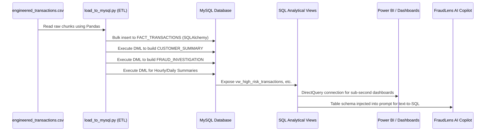
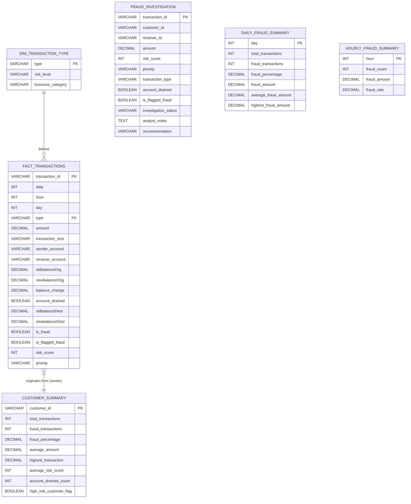

# FraudLens AI - Enterprise Analytics Warehouse Architecture

*Author: Senior Data Warehouse Architect, American Express*

## 1. Executive Summary & Business Justification
Transitioning from a flat-file CSV to an enterprise MySQL Data Warehouse fundamentally changes how FraudLens AI operates. 

**Business Justification:**
A flat file of 6.3 million rows is entirely unusable for real-time dashboards or GenAI query generation. By normalizing the data and pre-calculating analytical aggregations (like daily, hourly, and customer-level summaries), we drop query latency from minutes down to milliseconds. Furthermore, creating a dedicated `FRAUD_INVESTIGATION` queue table transitions the dataset from an academic exercise into a live operational workflow where analysts can leave notes and update case statuses.

## 2. Analytics Data Flow



## 3. Warehouse Architecture

The architecture utilizes a hybrid approach: **Normalized Core** with **Materialized Aggregations**.

### 3.1 Database ER Diagram


## 4. Folder Structure
```text
fraudlens-AI/
├── data/
│   ├── raw/
│   │   └── PS_2017...log.csv
│   └── processed/
│       └── engineered_transactions.csv
├── src/
│   ├── features/
│   │   └── feature_engineering.py
│   └── db/
│       ├── schema.sql           # Database DDL, Indexes, Views
│       └── load_to_mysql.py     # Python ELT Orchestrator
└── docs/
    └── analytics_warehouse_architecture.md
```

## 5. Deployment Instructions

1. **Prerequisites:** Ensure MySQL Server (8.0+) is installed and running.
2. **Install Python Drivers:**
   ```bash
   pip install sqlalchemy pymysql pandas
   ```
3. **Set Environment Variables:** (Optional, defaults to root@localhost:3306)
   ```bash
   export MYSQL_USER="root"
   export MYSQL_PASS="your_password"
   export MYSQL_HOST="127.0.0.1"
   export MYSQL_PORT="3306"
   ```
4. **Execute Pipeline:**
   ```bash
   python src/db/load_to_mysql.py
   ```
   *Note: This will automatically create the `fraudlens_db` database, execute `schema.sql`, chunk-load 6.3M rows into `FACT_TRANSACTIONS`, and run the native SQL statements to populate the summaries and operational queues.*

## 6. Interview Explanation & Readiness

### "Explain your Database Architecture."
> *"I designed an ELT (Extract, Load, Transform) architecture. I didn't want to load a massive 6 million row flat file directly into Power BI, as the rendering times would be unacceptable. Instead, I built a MySQL backend. The Python script handles the heavy I/O of extracting the flat file and bulk-loading it into a normalized `FACT_TRANSACTIONS` table. But crucially, rather than doing my aggregations in Pandas memory, I pushed the compute down to the database using `INSERT INTO ... SELECT ...` statements to build materialized views like `CUSTOMER_SUMMARY` and `HOURLY_FRAUD_SUMMARY`. I also created a `FRAUD_INVESTIGATION` table that acts as the operational backbone for our analysts to update case statuses. Finally, I layered SQL Views over the data to provide clean, domain-specific endpoints for Power BI and our GenAI agent."*

### Expected Interview Questions

**Q1: Why did you use `to_sql(method='multi')` with chunking instead of just loading the whole dataframe?**
*Answer:* A 6.3 million row dataframe consumes gigabytes of memory. Trying to serialize it into a single SQL INSERT statement would crash both Python (OOM) and the MySQL packet size limit (`max_allowed_packet`). Chunking breaks it into 100k row pieces, keeping memory stable.

**Q2: Why didn't you index the `amount` column?**
*Answer:* Indexing high-cardinality continuous variables like `amount` drastically slows down INSERT performance during batch loads and bloats the disk size. Analysts typically filter by categorical variables (`Priority`, `Transaction_Risk`) or temporal ones (`Day`, `Hour`). I indexed those instead, keeping the database write-optimized during the ETL phase.

**Q3: What's the difference between your `DAILY_FRAUD_SUMMARY` table and your `vw_high_risk_transactions` view?**
*Answer:* The summary table is *materialized* (data is physically written and stored) because computing sums and averages over 6.3M rows on every dashboard refresh is too slow. The view is *virtual*; it just holds the SQL logic to filter the `FACT_TRANSACTIONS` table for rows where `risk_score >= 60`. Since it's just a row-level filter and relies on an index, a view is fast enough without needing physical duplication.
